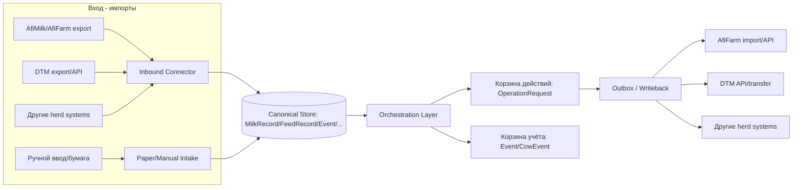
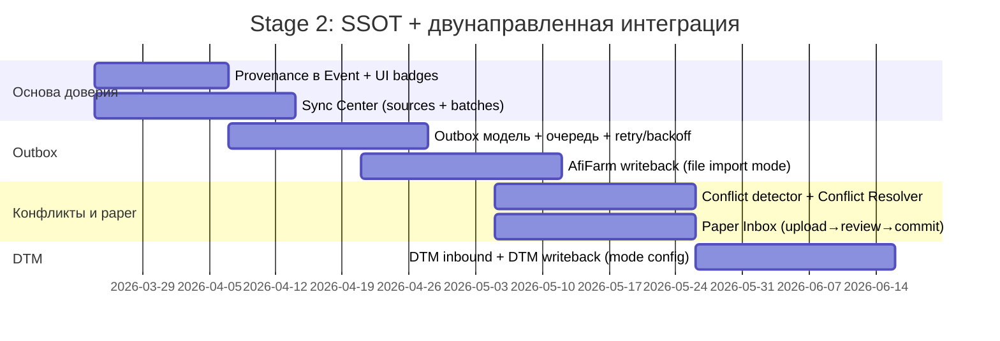

# Stage 2 для платформы ВЕТАИ (Antigravity): UX‑слой доверия и двунаправленная интеграция данных

[Скачать .md‑версию документа](sandbox:/mnt/data/Stage2_ТЗ_Единый_источник_истины_и_двунаправленная_интеграция.md)

## Резюме этапа и критерии успеха

Stage 1 уже дал “скелет” продукта: формы, страницы, дашборды, карточки коров/групп/секций, отчёты и навигацию. Stage 2 — это **слой пользовательского опыта (UX) поверх данных**, который превращает систему из “витрины фактов” в **операционный слой доверия**: он делает данные объяснимыми (кто источник и когда пришло), управляемыми (куда их отправить дальше), и пригодными для ежедневной работы (задачи/алерты/проверки), сохраняя совместимость с уже существующим сервисом.

С практической стороны Stage 2 отвечает на четыре отраслевые боли, которые постоянно всплывают у владельцев ферм и персонала:

1) **Множественные источники и «зоопарк программ»** → единая панель интеграций и единые “карточки истины”, чтобы не собирать всё в Excel. citeturn4search0  
2) **Дублирование и ручная перепроверка** → прозрачные правила дедупликации и синхронизации; видимые конфликты, а не «тихие расхождения». Практика “синхронизация вместо двойного ввода” прямо используется поставщиками датчиков: интеграция обещает убрать double data entry и синхронизировать группы/отёлы/осеменения и т.д. citeturn9search1turn4search2  
3) **Бумажная работа и задержка ввода** → входящая очередь бумажных записей и полуавтоматическое превращение “бумажки” в событие/задачу/экспорт. Рынок уже продаёт «безбумажность» как ценность и обещает убрать printed lists и retroactive input. citeturn9search0turn9search8  
4) **Сложные интерфейсы и много шагов на простые операции** → UX‑паттерны «action lists» и role-based worklists, быстрые действия и минимум кликов. Жалобы про “слишком много шагов” и “confusing” — типовые. citeturn3search0turn4search1  

### Главная идея Stage 2

Stage 2 делает ВЕТАИ **единственным источником истины (SSOT)** на уровне управленческого и операционного решения, но не пытается «переписать рынок». Формула:

- ВЕТАИ агрегирует и объясняет данные (provenance + trust).  
- ВЕТАИ управляет тем, что нужно сделать (корзина “действия”).  
- ВЕТАИ хранит полный журнал фактов (корзина “учёт”).  
- ВЕТАИ гарантирует движение данных **в обе стороны**: inbound (из систем) и outbound/writeback (в системы).

Это максимально близко к тому, как AfiFarm позиционирует свою ABC‑панель: “attention lists” и “action lists” — задачи к выполнению и проблемы к решению. citeturn9search30turn6view0  

### Цели Stage 2

- Закрыть **двунаправленное движение данных**:
  - “вход”: от Afimilk/AfiFarm, Dinamica Generale DTM и других доильных/сенсорных систем → в ВЕТАИ (для анализа, отчётов, задач/алертов);  
  - “выход”: от ручного ввода/сканирования/правок в ВЕТАИ → обратно в AfiFarm, DTM и другие herd‑системы (writeback/outbox).  
- Разделить данные на две корзины:  
  1) **Текучка/действия** (операции, задачи, алерты, проверки);  
  2) **Учёт/история/отчёты** (полная фактология, журналы, длинные временные ряды).  
- Свести к минимуму “ручной перевод данных между системами” и сделать этот перевод **управляемым и прозрачным**, если полностью автоматизировать нельзя на конкретной ферме.

### Метрики успеха (обязательные)

- **Доля операций, закрытых без двойного ввода**: % OperationRequest, которые после подтверждения автоматически уходят во внешнюю систему или формируют “пакет отправки” (outbox) без ручного переписывания.  
- **Время “случилось → стало действием”**: медиана и p90 времени от `occurredAt` (факт) до создания “действия” (OperationRequest) и первого подтверждения.  
- **Интеграционная стабильность**: доля IntegrationBatch со status=error и среднее время устранения ошибок. В AfiFarm отдельно подчёркивается, что неразрешённые ошибки импорта блокируют перенос данных и вредят целостности. citeturn8search1  
- **Writeback reliability**: доля outbox‑элементов в статусе ACKED от всех отправленных; p90 время “PENDING → ACKED”.  
- **Шум/польза**: доля алертов/задач, помеченных как “ложно/неактуально/дубликат”.  
- **“Дырки данных”**: количество конфликтов и “не сопоставлено с коровой/группой/секцией” на 1000 записей импорта.

## Продуктовая модель: две корзины и событие с происхождением

Ниже — базовое объяснение “как думает ферма” для не‑фермера и как это превращается в структуру Stage 2.

### Базовые сущности фермы (упрощённо)

- **Корова** живёт в **группе** (например, высокоудойная, свежая, сухостой) и физически находится в **секции/загоне**.  
- Производственный день цикличен: **доения** идут сессиями (обычно 2–3 раза/день), кормление — партиями/замесами (TMR), плюс ежедневные обходы. В “молочной” части AfiFarm фиксируется, что показатели ежедневной продуктивности обновляются **в конце каждой сессии**. citeturn8search12  
- Ключевой управленческий объект — **событие**: отёл, охота/осеменение, диагноз, лечение, перевод, выход (выбраковка/продажа/падёж), ошибка идентификации в доильном зале, отклонение кормления и т.д. Многие такие события AfiFarm требует фиксировать как “Data Entry” (calving, exit и т.п.). citeturn8search2turn5search30  

### Что такое «текучка» и «учёт»: таблица для не‑фермера

| Категория данных | Зачем это нужно | Примеры | Где живёт в ВЕТАИ (Stage 2) | Внешние системы‑получатели |
|---|---|---|---|---|
| Текучка / действие | Чтобы сегодня/в эту смену кто‑то сделал шаг | “Осмотреть”, “Осеменить”, “Исправить ID”, “Отправить событие в AfiFarm” | OperationRequest (+ statusHistory, confirmations) | AfiFarm, DTM, herd‑system |
| Учёт / факт | Чтобы было «что именно произошло» и можно было доказать/проанализировать | отёл, лечение (препарат/доза), выход, замес, удой | Event/CowEvent, MilkRecord, FeedRecord, Observation | AfiFarm, лаборатории, отчёты |
| Временные ряды | Чтобы видеть динамику и строить отчётность | удой по сессиям, измерения датчиков | MilkRecord / MetricValue | аналитика, алерты |
| Ошибки данных | Чтобы «починить систему», иначе всё остальное недостоверно | импорт упал, не совпали ID, дубликаты | IntegrationBatch + OperationRequest (для фикса) | — |
| Справочники и сопоставления | Чтобы связывать источники и говорить на одном языке | внешний cowId, код секции, группа в DTM | ExternalIdentity + Section.dtmCode/afiCode | AfiFarm, DTM |

### Корзина «Текучка / Действия»

Это всё, что требует реакции в горизонте часов/дней и должно быть **видимо как worklist** — «что делать сегодня». В AfiFarm это формулируется как “action lists with tasks to perform, and problems to solve”. citeturn9search30  

Технически в Stage 2 это:
- OperationRequest как “атом” действия;  
- статусы, которые отражают реальное движение данных: “взято в работу”, “подтверждено”, “отправлено в AfiFarm”, “подтверждено внешней системой”, “ошибка”.

### Корзина «Учёт / История / Отчёты»

Это полный журнал того, что произошло, включая детали, которые не всегда нужны “прямо сейчас”, но нужны для:
- недельных/месячных отчётов,
- доказуемости (когда внесли, кто подтвердил),
- ретроспективного анализа.

### “Событие с происхождением” как фундамент доверия

Чтобы система стала SSOT, **каждый факт обязан отвечать на 5 вопросов**:

1) **Что** произошло? (тип события)  
2) **С кем/где**? (cow/group/section/barn)  
3) **Когда произошло**? (`occurredAt`)  
4) **Когда дошло до ВЕТАИ**? (`receivedAt`)  
5) **Можно ли этому верить и кем подтверждено**? (trust/confirmation)

Практический смысл: на ферме события часто заносятся позже, чем происходят, и это нормально. Например, AfiFarm подчёркивает, что отёл должен быть введён “как можно скорее”, а если событие отёла не внесено в течение 24 часов после прекращения признаков отёла, AfiFarm считает, что отёл был, но не внесён, и убирает корову из отчёта. citeturn8search2  

Stage 2 делает такую задержку **явной** (видна и управляемая) и даёт инструмент вернуть консистентность.

### Обязательные статусы доверия (UI + логика)

В Stage 2 вводится единый набор trust‑состояний (в UI как badges/chips и в логике как поля/metadata):

- **SOURCE_OK** — пришло из системы‑источника и прошло валидацию (например, AfiFarm export после сессии). citeturn8search0turn8search12  
- **UNCONFIRMED** — распознано/введено, но требует подтверждения (например, бумажка)  
- **CONFIRMED_HUMAN** — подтверждено человеком (ветврач/зоотехник/менеджер)  
- **CONFLICT** — два источника дают несовместимые значения  
- **STALE** — “последнее обновление” старше допустимого окна  
- **WRITEBACK_PENDING / WRITEBACK_SENT / WRITEBACK_FAILED** — состояние обратной отправки во внешние системы

## Двунаправленное движение данных: архитектура, правила, интеграции

Stage 2 вводит **единый контур данных**: Inbound (import) → Canonical store → Orchestration → Outbound (writeback).



### Матрица интеграций Stage 2 (MVP)

| Система | Вход в ВЕТАИ | Выход из ВЕТАИ | Объекты (MVP) | Частота | Важные ограничения/заметки |
|---|---|---|---|---|---|
| AfiFarm | экспорт файлов по расписанию, включая “после каждой сессии/дойки” citeturn8search0 | импорт файлов по протоколу или партнёрский API (если доступен) citeturn7search2turn1view1 | animals master, milking/production, ключевые события | near‑real‑time по сессиям | ошибки импорта критичны; “Third‑party report” говорит, что неразрешённые ошибки блокируют перенос данных citeturn8search1 |
| AfiMilk→MINDA (референс) | — | экспорт heat events каждые 5 минут citeturn8search4 | heat events | 5 минут | пример частоты/идемпотентности; не универсальный API |
| DTM | API или файлы/USB (режим выбирается) citeturn9search2turn9search6 | API или файлы/USB | FeedRecord/Mix/stock + headcount | ежедневный/почасовой | DTM умеет обмен данными и уведомления (email/WhatsApp), плюс заявлен API для интеграции третьей стороной citeturn8search3turn9search2 |
| Herd systems (generic) | CSV/Excel import + шаблоны | CSV/Excel export + outbox‑пакеты | события/журналы | по потребности | фермы часто живут на смеси систем и вручную сводят их в таблицы citeturn4search0 |

### Inbound: как “забирать” данные от внешних систем

#### AfiMilk / AfiFarm (вход)

AfiFarm поддерживает планирование автоматического экспорта данных файлами, включая варианты «после каждой сессии» или «после каждой дойки». citeturn8search0turn7search5  

Stage 2 обязан работать минимум в режиме **file‑ingestion**:

- В AfiFarm настраивается экспорт (через AfiControl Data Export / протокол). citeturn7search5  
- ВЕТАИ ingest‑ит файлы, создавая IntegrationBatch и заполняя поля партии (recordsRead/Inserted/Updated/Skipped, errors).  
- ВЕТАИ обновляет `DataSource.lastSync` и freshness‑индикаторы на UI.

**Обязательное UX‑требование:** ошибки импорта не могут быть «в логах». AfiFarm прямо говорит: ошибки показываются в Herd Update Result window, и критично решить каждую; иначе перенос данных остановится и целостность животных пострадает. citeturn8search1  

Stage 2 должен:
- выводить ошибки как первоклассную сущность (/sync → /batches → /errors);  
- создавать OperationRequest “исправить сопоставление/данные”;  
- давать кнопку “повторить импорт” после исправления.

#### Важная деталь про ID‑бирки при обмене с AfiFarm

AfiFarm документирует, что импорт/экспорт идёт через протоколы, и что некоторые поля (например, Tag IDs / Active tag IDs) могут влиять на сопоставления; есть настройки исключения Tag ID при импорте. citeturn7search1  

В Stage 2 это превращается в требование:

- в “Mappings” UI должно быть видно, **кто управляет tag IDs** (AfiFarm или внешний источник);  
- политика “не перетирать tags из внешнего импорта” должна быть доступна на уровне DataSource.

#### DTM (вход)

DTM — облачная система управления кормлением; в официальном описании упоминается 4G modem for data exchange и приложение, а также мониторинг и контроль feed costs/inventory/ration adjustments/feed efficiency. citeturn9search6turn9search10  

Доступность API/коннективности подчёркивается функциональными материалами: заявлены “API to connect from other software” и notification center с историей алертов. citeturn9search2turn8search7  

Stage 2 обязан заложить два режима источника DTM (выбираются в `DataSource.config`):
- **DTM_API_MODE** (контракт уточняется, поля помечаются как “не указано”)  
- **DTM_FILE_MODE** (обмен файловыми выгрузками/USB)

### Orchestration layer: как формируются задачи/уведомления/алерты

Stage 2 вводит “правила маршрутизации” (deterministic rule set), которые конвертируют факты в действия:

- Факт/временной ряд (MilkRecord, AfimilkDayMilk, FeedRecord, MetricValue)  
- → Event с provenance/trust  
- → (опционально) OperationRequest как action item с dueDate и приоритетом.

Референс‑паттерн: AfiFarm “Fresh cows to check” сравнивает удой “за последние 24 часа” с “средним за 10 дней”, плюс использует DIM (days in milk). citeturn8search10  

**MVP правила Stage 2 (обязательные 8):**
1) Yield drop vs baseline (на уровне коровы/группы) → задача “проверить”  
2) Fresh cow check (DIM окно + падение удоя) → вет‑задача citeturn8search10  
3) Feeding deviation (planned vs actual, remainder) → кормление/менеджер  
4) Not identified milking record (cowId null) → оператор/данные  
5) Integration batch error → менеджер (ссылка на batch/errors)  
6) Not exported critical event (pending writeback) → менеджер  
7) Duplicate ID detected → задача “исправить ID” (ссылка на mapping) (у других систем это критичная тема) citeturn9search9  
8) Stale source (lastSync > SLA) → уведомление руководителю

### Outbound: writeback в AfiMilk/AfiFarm, DTM и herd‑systems

Outbound — ключевой новый компонент Stage 2. Его задача: чтобы изменения/факты, появившиеся в ВЕТАИ (вручную, с бумаги, из алерта), могли быть **направлены обратно** в “системы исполнения” (AfiFarm/DTM/другие).

#### Принцип Outbox

Любое действие, требующее записи во внешней системе, переводится в управляемый хвост:

- `OperationRequest.status = PENDING_<SYSTEM>_WRITEBACK`  
- создаётся outbox‑элемент (см. ниже «Модель данных»)  
- пользователь либо нажимает “Отправить”, либо включена авто‑отправка.

Это снимает проблему “я сделал в поле, а вечером ещё два раза переписал это в разные программы” — ровно то, что отрасль пытается устранить мобильными приложениями и paperless‑подходом. citeturn9search0turn9search16  

#### Таблица: coverage writeback (Stage 2 MVP)

| Тип события/действия | ВЕТАИ создаёт | Отправить в AfiFarm | Отправить в DTM | Комментарий |
|---|---:|---:|---:|---|
| Отёл (Calving) | Event + OperationRequest | да | нет | критично по времени; AfiFarm ожидает быстрый ввод citeturn8search2 |
| Осеменение/охота | Event + OperationRequest | да | нет | зависит от протокола/фермы |
| Запуск (Dry off) | Event + OperationRequest | да | нет | |
| Выход (Exit) | Event + OperationRequest | да | нет | AfiFarm имеет отдельный Exit Event ввод citeturn5search30 |
| Перевод/группа/секция | Event + OperationRequest | да | (частично) | DTM может использовать headcount/группы |
| Кормовые планы/рецепты | FeedRecipe + OperationRequest | нет | да | зависит от того, DTM ли “исполнитель” |

#### AfiFarm (выход)

**Три режима writeback в AfiFarm (на ферме выбирается один):**
1) **AFIFARM_FILE_IMPORT** — ВЕТАИ генерирует файл в согласованном протоколе; AfiFarm подхватывает его через Schedule Data Import. citeturn7search2turn8search5  
2) **AFIFARM_API_PARTNER** — если на ферме активирован партнёрский API‑протокол. Пример: интеграция AfiFarm↔MINDA (импорт до 4 раз/день; экспорт тепловых событий каждые 5 минут). citeturn1view1turn8search4  
3) **AFIFARM_ASSISTED_ENTRY** — если автоматический writeback невозможен: ВЕТАИ создаёт “пакет ввода” (структурированная карточка), который переносится в AfiFarm за 30–60 секунд, а затем подтверждается (OperationConfirmation.afiEntryNumber/afiEntryDate).

#### DTM (выход)

DTM ориентирован на управление кормовым процессом, “каждый грамм отслеживается”, плюс указывается обмен данными (модем/приложение) и уведомления о низком остатке компонентов. citeturn9search6turn8search3  
Функциональные материалы заявляют API для интеграции третьей стороной (подчёркивая, что реализация делается third party). citeturn9search2turn5search3  

Stage 2 обязует реализовать outbox‑writeback для DTM в двух режимах:
- **DTM_API_MODE** — push через API (контракт “не указан”; нужен подтверждённый документ от поставщика)  
- **DTM_FILE/USB_MODE** — экспорт файлов для загрузки в DTM/устройство

### Правила дедупликации и разрешения конфликтов (Stage 2)

Stage 2 вводит строгое правило: «лучше показать конфликт и попросить решение, чем тихо перезаписать и потерять доверие».

**Дедупликация (обязательное):**
- Дедуп‑ключ: `farmId + source + sourceRecordId` (если есть), иначе `dedupeKey` по доменному типу (cowId + eventType + occurredAt bucket).  
- При совпадении dedupe: update, а не insert.

**Матрица решения конфликта (MVP):**

| Ситуация | Auto‑решение | Когда нужна ручная развязка |
|---|---|---|
| человек подтвердил одно из значений | confirmed побеждает | почти никогда |
| два “машинных” источника спорят | выбираем по доверенности источника и свежести | если обе доверенности равны |
| бумажка vs импорт | бумажка после подтверждения побеждает | если конфликт в “неразрешимых” полях (ID) |
| внешняя система отклонила writeback | не меняем факт, создаём FAILED + задача | всегда |

Основание: реальные фермы часто объединяют источники вручную (Excel, отчёты молоковоза, лаборатории) и не верят «тихим перезаписям». citeturn4search0  

## UX Stage 2: новые экраны, индикация, кнопки и стиль

Stage 2 — это не «интеграции ради интеграций», а UX, который делает их осмысленными и быстрыми. Референсы: AfiFarm ABC (attention/action lists) и Afi2Go Prime (role-based worklists и “few clicks”). citeturn9search30turn9search0  

image_group{"layout":"carousel","aspect_ratio":"16:9","query":["AfiFarm ABC dashboard attention lists action lists screenshot","Afi2Go Prime worklists screenshot","DTM dashboard feeding management screenshot","DTM app feeding process screenshot"],"num_per_query":1}

### Новые разделы в sidebar (Stage 2)

- **Синхронизация** (`/sync`)  
- **Входящие** (`/inbox`)  
- **Исходящие (Outbox)** (`/outbox`)  
- **Конфликты** (`/conflicts`)  
- **Бумажные записи** (`/paper-inbox`)  
- **Сопоставления (Mappings)** (`/mappings`)  

### Таблица: новые экраны Stage 2

| Экран | URL | Для кого | Главные действия | Ключевые UI‑компоненты |
|---|---|---|---|---|
| Sync Center | /sync | руководитель/админ | sync now, открыть ошибки, тест соединения | SourceCards, BatchTable, HealthBanner |
| Inbox | /inbox | админ/менеджер | подтвердить, сопоставить, создать задачу | ReviewQueue, MatchCowDialog |
| Outbox | /outbox | менеджер | отправить, bulk send, retry, отметить внесённым вручную | OutboxTable, StatusStepper |
| Conflicts | /conflicts | менеджер | принять A/B, ручной ввод, отложить | DiffViewer, PolicyHint |
| Paper Inbox | /paper-inbox | любой с правами | загрузить документ, распознать/исправить, подтвердить | DocumentCards, FieldExtractor |
| Mappings | /mappings | админ | связать ID, правила “не перетирать” | MappingTable, SourceChip |

### Экран: Sync Center (`/sync`)

**Назначение:** дать руководителю и администратору одну страницу, где видно: что подключено, что сломалось, что устарело, что ждёт отправки.

**Карточка источника (“AfiFarm”, “DTM”)**
- Статус: ✅ OK / ⚠️ Warning / ⛔ Error  
- Last sync: “Обновлено 10 мин назад”  
- Freshness SLA: “Окно: после каждой сессии” (под AfiFarm export) citeturn8search0turn8search12  
- Ошибки: количество ошибок последней партии (IntegrationBatch.errors)  
- Очередь исходящих: “12 записей ждут отправки”

**Кнопки:**
- `Синхронизировать сейчас`  
- `Проверить подключение`  
- `Открыть ошибки`  
- `Открыть сопоставления`

### Экран: Outbox (`/outbox`) — индикация движения данных «туда»

Каждая запись в outbox должна иметь stepper:

- “Событие создано” → “Проверено” → “Отправлено” → “Принято”  
- при ошибке: красный шаг + “Причина” + CTA “Повторить/изменить”.

### Экран: Paper Inbox (`/paper-inbox`) — превращаем бумагу в SSOT

Поток:
1) `Добавить документ` → фото/скан  
2) `Выбрать тип` (treatment / calving / insemination / move / note)  
3) `Поля` (авто + ручная правка)  
4) `Подтвердить` → создаётся Event (+ OperationRequest, если нужно действие)  
5) `Отправить` → запись появляется в Outbox

Почему это критично: “безбумажные” продукты обещают убрать printed lists и retroactive input, показывая, что боль массовая. citeturn9search0turn9search20  

### Стиль (UI tokens) — чтобы «приукрасить» и сделать единым

Stage 2 не должен выглядеть как новая подсистема. Он расширяет существующий дизайн, но добавляет узнаваемые элементы доверия/интеграций.

```css
:root {
  --radius-lg: 14px;
  --shadow-soft: 0 6px 24px rgba(0,0,0,.08);

  --critical: #E5484D;
  --warning:  #F5A524;
  --ok:       #30A46C;
  --muted:    #6B7280;

  --chip-bg:  rgba(0,0,0,.04);
}
```

**Компоненты:**
- `SourceChip` (AfiFarm/DTM/Manual/Paper)  
- `TrustBadge` (Verified/Unconfirmed/Conflict/Stale)  
- `StatusStepper` (Occurred → Received → Approved → Sent → Acked)  
- `DiffViewer` (A vs B)  
- `BatchCard` (IntegrationBatch: counters + error peek)

**Микро‑детали:**
- hover: подсветка строки + быстрые действия справа  
- badges кликабельны → фильтр  
- skeleton loading + “данные устарели” баннер при stale source  
- empty states: “Нет конфликтов — отлично. Последняя проверка 06:15.”

## Техническая реализация Stage 2 поверх существующего сервиса

### Модель данных: минимальные изменения

Сейчас в схеме уже присутствуют ключевые сущности для Stage 2:
- OperationRequest/OperationConfirmation для корзины действий и подтверждений  
- Event/CowEvent для учёта фактов  
- DataSource/IntegrationBatch для импорта  
- ExternalIdentity + Section.dtmCode/afiCode для сопоставления ID по внешним системам  

Недостаёт (строго для Stage 2):

1) **Provenance/Trust поля в Event**  
   - `receivedAt` (когда пришло в ВЕТАИ)  
   - `sourceRecordId` (ID во внешнем источнике)  
   - `dedupeKey` (детерминированный ключ дедупликации)  
   - `confirmationStatus` / `confirmedAt` / `confirmedById`  
   - `confidenceScore` (если событие распознано/вычислено)

2) **Outbox сущность для writeback** (новая таблица; строго необходима)  
   Минимальные поля:
   - `farmId`, `dataSourceId`, `operationRequestId?/eventId?`, `payloadJson`  
   - `status`, `attempts`, `nextRetryAt`, `lastAttemptAt`  
   - `externalAckId?`, `errorMessage?`, timestamps

### Контракты внутренних API (пример)

- `GET /api/sync/sources` → список DataSource + lastSync + health  
- `GET /api/sync/batches?sourceId=...` → IntegrationBatch  
- `GET /api/outbox?status=...&target=...` → очередь writeback  
- `POST /api/outbox/{id}/send` → отправка  
- `POST /api/outbox/{id}/ack` → подтверждение  
- `GET /api/conflicts` → список конфликтов  
- `POST /api/conflicts/{id}/resolve` → решение (accept A/B/manual)  
- `POST /api/paper/upload` → загрузка документа  
- `POST /api/paper/{id}/commit` → создание Event/OperationRequest

### Надёжность и обработка ошибок

**AfiFarm импорт/экспорт:**  
- В AfiFarm импорт/экспорт завязаны на протоколы и расписания. citeturn7search2turn8search0  
- Ошибки импорта нужно поднимать в UX как задачи; иначе интеграция «тихо ломается», а AfiFarm предупреждает, что это ударяет по целостности данных. citeturn8search1  

**Retry/Backoff:**
- writeback retries: exponential backoff (1м, 5м, 30м, 2ч…) + “retry сейчас”  
- maxAttempts (по умолчанию 10), затем FAILED и задача менеджеру

## План реализации, контрольные точки и критерии приёмки

### Развертывание по подэтапам (Stage 2.x)



### Критерии приёмки Stage 2 (минимум)

Считать Stage 2 выполненным, если:

- есть `/sync` с карточками источников, партиями импорта и понятным статусом ошибок;  
- есть `/outbox` и writeback‑поток с PENDING→SENT→ACKED/FAILED;  
- есть отправка минимум 3 типов событий в AfiFarm в режиме file‑import или partner API (если доступен); механизм Data Import/Export AfiFarm учитывается. citeturn7search2turn7search5turn8search4  
- есть `/conflicts` и ручное разрешение конфликта “дата/группа” с audit‑следом;  
- есть `/paper-inbox` с flow upload→review→commit и появлением writeback‑элемента;  
- в карточке коровы/группы отображается происхождение ключевых полей (source chips) и актуальность (stale);  
- для ошибок импорта создаётся задача менеджеру (OperationRequest), и она видима в “текучке”.